# Introduction to the Many-Worlds Interpretation (MWI)

Quantum mechanics emerged in the early 20th century to explain strange behaviors at the atomic and subatomic levels—such as electrons existing in multiple states at once or particles behaving like both waves and particles.

Mathematically, quantum systems are described by a wavefunction (Ψ), which evolves deterministically over time according to the Schrödinger equation. This wavefunction contains all possible outcomes of a system.

# Copenhagen Interpretation vs. MWI

From the experiment we can know that:

- Before measurement, particles exist in a **superposition** of all possible states.
- After measurement, we observe **one definite outcome**.

But where do the results come from?

The Copenhagen Interpretation, developed primarily by Niels Bohr and Werner Heisenberg in the 1920s, was the first and most widely accepted explanation of this puzzle.

The main idea includes:

- The wavefunction represents **our knowledge** of a system, not objective reality.
- When a measurement is made, the wavefunction **collapses** into a single outcome.
- Prior to observation, physical properties are **undefined** or "potential."

But it is clear that the Copenhagen interpretation suffers from a great deal of ambiguity: it has no clear way of defining “observation” or the observer, nor does it explain what actually exists before the observation.

In 1957, physicist Hugh Everett III proposed the Many-Worlds Interpretation as a clean, deterministic alternative to Copenhagen.

In this theory:

- The wavefunction **never collapses**.
- All possible outcomes of quantum events **actually happen**—in **separate branches** of the universe.
- Measurement causes **decoherence**, not collapse: the world "splits" into multiple, non-interacting outcomes.

For example:

- A particle in superposition doesn’t choose one outcome.
- Instead, the universe **branches**, and each outcome occurs in its own “world.”

Further reasoning, any "forking" behavior may not exist, but the world line corresponding to each result itself always exists, and the observer moves between these worlds.
# Schrödinger's Cat

Erwin Schrödinger proposed his famous thought experiment in 1935:

- Imagine a cat sealed in a box.
- Inside, there is a radioactive atom with a 50% chance to decay in one hour.
- If it decays, a Geiger counter triggers a hammer that breaks a vial of poison, killing the cat.
- If it doesn’t decay, the cat lives.

In the Copenhagen interpretation, the system remains in superposition (cat is dead and alive) until a measurement is made. At the moment of observation, the wavefunction collapses into one of the two possibilities:

- You see a **live cat**, or
- You see a **dead cat**.

Only one outcome becomes real, and the other disappears. The act of observation causes reality to “choose.”

MWI gives a different answer:
- The cat is both dead and alive, but in different worlds. 
	- In one **branch** of the universe, the atom decays → poison is released → the cat dies.
	- In another **branch**, the atom does not decay → the poison is not released → the cat lives.

These two outcomes both happen, in separate branches of reality. There is no collapse but decoherence, which prevents the branches from interfering with each other:
- When you open the box, **you** also become part of the superposition:
	- One version of you sees a **dead cat**.
	- Another version sees a **live cat**.

From **your** perspective as the observer:
- You will experience **only one outcome** (say, the live cat).
- But **another version of you**, equally real, experiences the **other** outcome (dead cat).
- You and your alternate self now live in **separate, non-interacting worlds**.

From the above content, we can find that if MWI exists, the world will be "split" all the time, and the observer will move all the time, from one world to another. For the sake of distinction, the "world" will be called "world line" to more accurately describe the history and future of each world.

---
# MWI and Reality 

The MWI is a large universe of possibilities. And each possibility is a frozen moment that our consciousness briefly visits. On top of this, our consciousness is constantly moving in and out of different realities. Since each reality is its own unique worldline, we can say that we are moving in and out of different worldlines.

When consciousness enters an individual's reality, this life begins a relatively fixed journey of life. Although we feel that we have free will and can choose our direction and thoughts, there are actually many invisible restrictions around us.

For example, when a baby first comes into this world, it cannot walk, talk, or even crawl, and can only lie in the crib. In theory, it may try to crawl to the edge of the bed and try to crawl out, but that is extremely limited "freedom".

## Start

We could assume that consciousness "activates" at some point early in life. For some people, this may happen in the womb; for others, it may be after birth. For most people, consciousness is unstable at first, and it may enter and leave the body from time to time until it finally stabilizes and truly integrates into this reality.

If we draw this process on a world line diagram, it is "falling into" the world line template map.

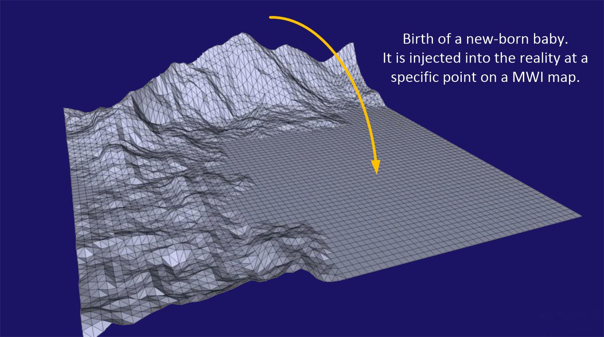

## The first few minutes

In the first few minutes, days, and months, freedom of movement is very limited. The consciousness is still learning how to move, learning how to use the body. So the actual physical activity it can do is limited.

However, if it pushed itself, and it strove to overcome, it could roll, crawl, move and do other things that are very difficult to do. These difficult things can be defined as hills and mountains on the template map. Using the Z-axis, the higher the “mountain”, the harder the effort. The shallower the depression, the easier the effort.

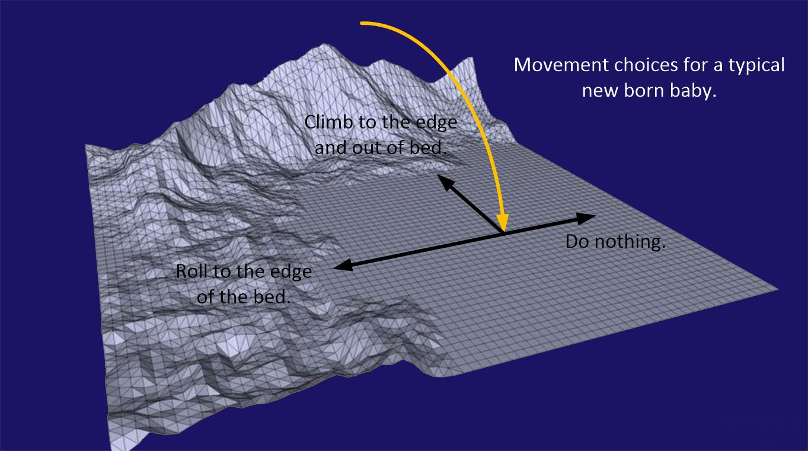

Over time, consciousness moves on this template map.

Depending on the personality of consciousness, it either chooses the easy route or it becomes a "tough guy" and pushes forward, striving to "climb those mountains."

We can conclude that before birth, everyone corresponds to a preset "world line template". This template largely determines the direction of your future development. Therefore, if you do nothing and live your life naturally, your future will be roughly predictable without much deviation.

But, if you decide to climb “those hills and mountains”, what then?

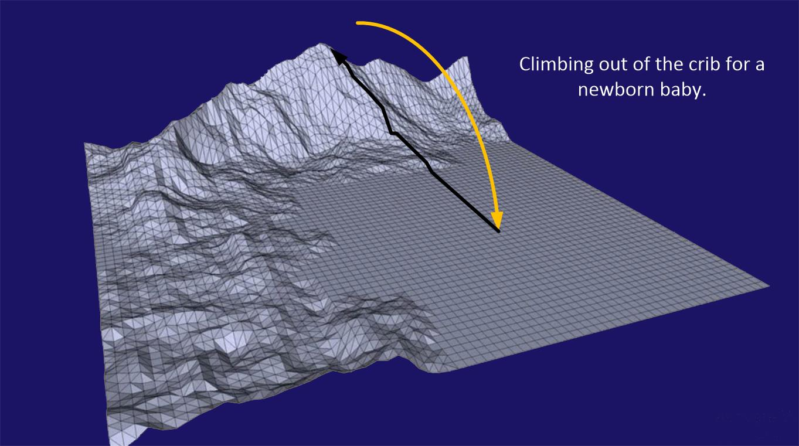

# Key Point

The height of the "mountain" is a measure of effort and deviation from the comfortable norm of the consciousness's pre-birth worldline template. When consciousness leaves the "flat, safe" median, it will change, but the change will not be great.

That is, the pre-birth worldline template will still remain pretty much the same. The consciousness will "climb that mountain" and then discover other areas that were originally forbidden to it, i.e., possibilities that were originally unreachable.

From the above inferences, it can be concluded that the location of entry into the template is very critical, which will determine how much effort the consciousness needs to put in to reach where they want to go.

# Glossary

#### Time

In the MWI, consciousness is constantly moving between worldlines, so what we call "time" is actually the experience and process of consciousness moving through the MWI. 

Therefore, each consciousness experiences their own version of "time", which is determined by the speed at which the consciousness travels between worldlines. A "unified" time exists within a single worldline, but this is of no help to consciousness.
#### Life-Line

A “life-line” is a collection of experiences that a consciousness has. As the consciousness moves in and out of individual moments of time, it creates a path. This path looks like a vector. It starts at the moment of birth and ends at the moment of death.

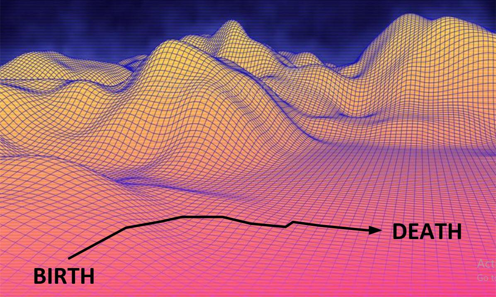

#### Time-Line

A timeline is a segment of a lifeline. It can be a continuous segment of any lifeline.

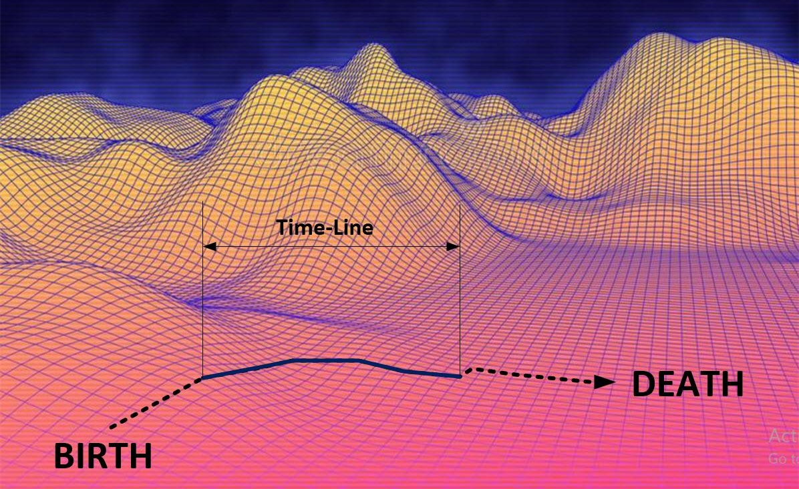

#### World-Line

A "world line" is a frozen moment, like a photograph. It contains its unique history and future. The history and future of each world line are different.

As far as using the world-line map template, each intersection point, dot or globe represents one such world-line.

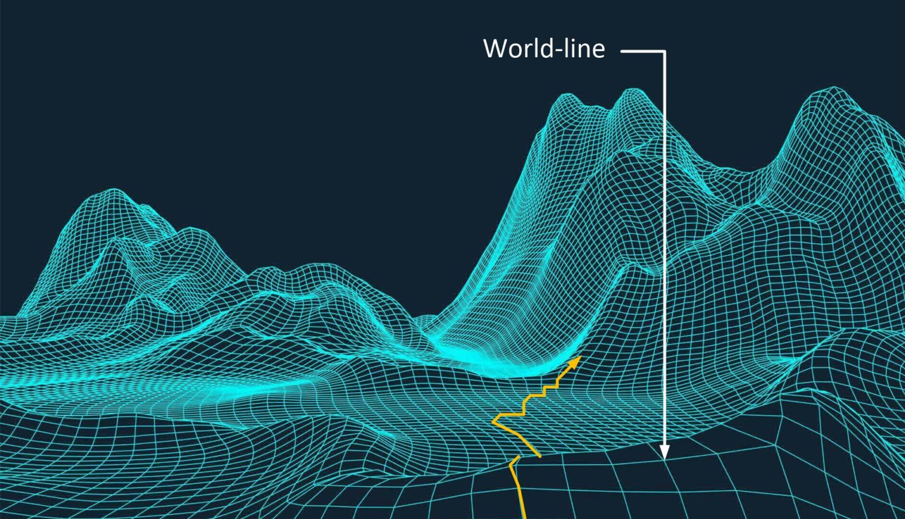

#### World-Line Cluster

If the number of consciousnesses is finite, but the number of worldlines is close to infinite, then the probability that each consciousness has its own worldline is greatest. In other words, shared worldlines are rare.

However, as the consciousness travels on the MWI it does so based upon it’s thoughts. If others share the same thoughts, they travel the MWI in a similar manner.

If you map out the Time-Lines of people who are sharing similar thoughts, you will find that they seem to travel together, and they seem to experience the same World-lines. Which known as clustering.

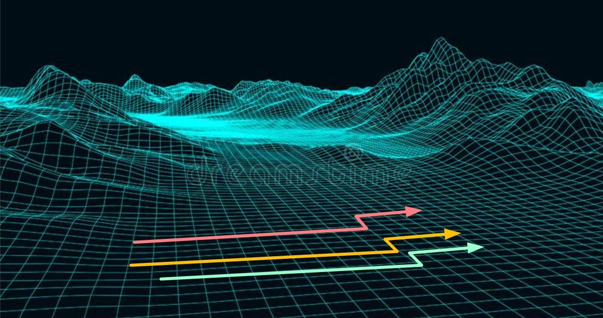

#### Echo Chamber

>In discussions of news media, an echo chamber refers to situations in which beliefs are amplified or reinforced by communication and repetition inside a closed system and insulated from rebuttal. By participating in an echo chamber, people are able to seek out information that reinforces their existing views without encountering opposing views, potentially resulting in an unintended exercise in confirmation bias. Echo chambers may increase social and political polarization and extremism. 
>-Wikipedia

If you only listen to a certain type of "news" and only receive opinions from others who agree with you, your thoughts will be reinforced into a set narrative and you will not be able to think other thoughts.

From the perspective of MWI, it is dangerous to be in a closed environment where thoughts are set to "be in a rut". It locks you into a path and drives you to a set place in MWI, whether good or bad. 
#### Template Map

The template map is a model used to visualize how consciousness moves in MWI. It can be thought of as a topological map, made up of grid intersections, each of which represents a "world line".

The shape of the map surface reflects the most likely path a consciousness can move through its physical body.

The height of the terrain represents the difficulty of movement. Flat areas symbolize easy movement without much effort, while "mountains" represent extremely high difficulties and challenges.

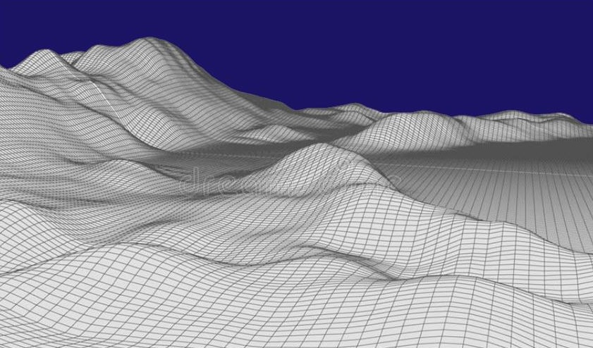

#### Pre-Birth World-Line Template Map

Refers to the first map that is set when a baby is born and the consciousness is injected into the body. This map is designed before the consciousness enters the material world, and its purpose is to allow the consciousness to experience a specific series of experiences in it. This is a carefully constructed specific life path.

In this map, the consciousness will travel along the most convenient path pre-set to experience a series of events.

The only way to leave this map is to "slide" into another completely different template map.
#### Slide

A slide is an intentional change of the template map. Consciousness “slide” off the map that you are on, and land on a completely different map.

While this can be accomplished through design, the most effective way (on an individual basis) is to do it through thinking. By specifically controlling your thoughts to slide out of the template map, sliding to the template that is next to it, like sliding from one layer of a layer cake to another.

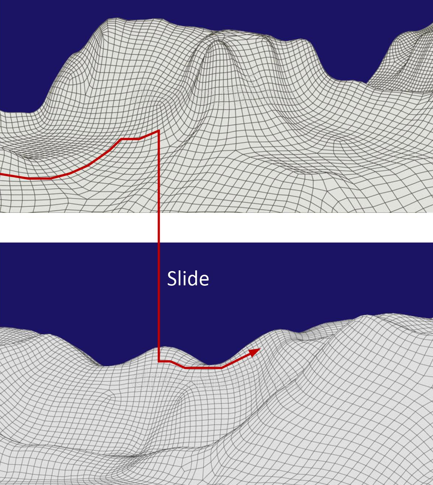

#### Shadow People

Consciousness travels through world lines alone. It is extremely rare for another consciousness to share a world line with us.

So for a consciousness, all these "people" it sees are actually just an empty container. They are real, and they have feelings that we react to, but its consciousness is not there, but on their own world line. This person on all other world lines is just a projection of the main consciousness.
#### Mountains

On the topography of a world-line template are “highs” and “lows”. These features define the difficulty of effort to move in those directions. A “mountain” is a particularly difficult are to traverse. And on the 3D map it will appear as a mountain.

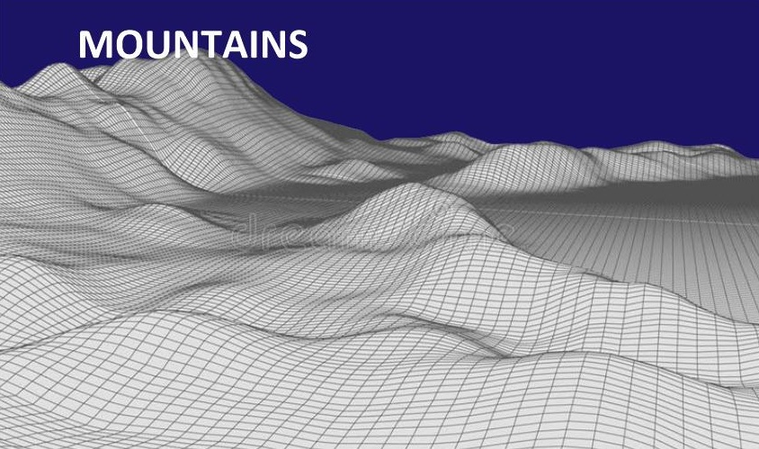

#### Hills

A hill is similar to a mountain. It’s level of difficulty to traverse is proportionally smaller.

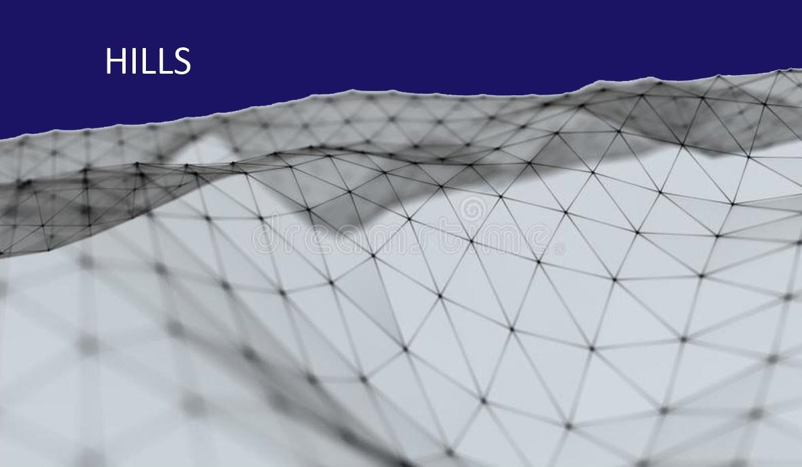

#### Comfort Zone

In actual experience, the flat, unruffled areas on the world line template map are the so-called "comfort zones". No matter how rugged and steep the terrain ahead looks, there will always be a relatively smooth and easy path in the world line template set before birth.

The good thing is that no matter what you face in life, there is always a "default route" waiting for you to move forward; it may be smooth or difficult, but it always exists.

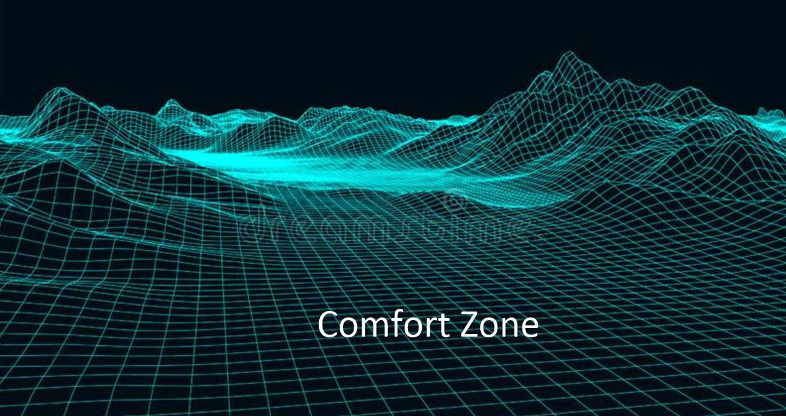

---