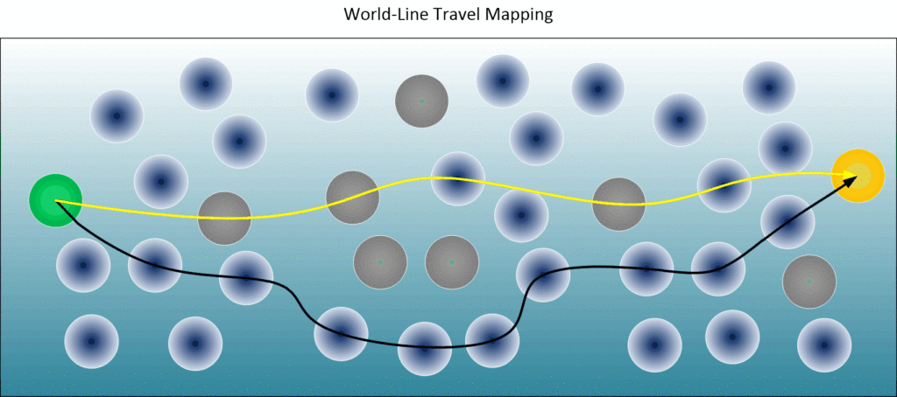

Released on April 1st, take it or not.

# Introduction 

Our thoughts control our reality. So if we want to live a “much improved” life, in whatever way we choose, we can manifest it. By understanding the way the universe works, the nature of consciousness, and the role thought has, you can pick and choose world-line destinations.

This means that you can direct your consciousness into the craziest, most complex worldline situations you can think of.

The only problem is that it takes time to manifest through world lines. The more outrageous the intention and desire, the farther the target world line is, and the more world boundaries your consciousness needs to pass through.

So to obtain the reality we want to inhabit, whatever that is, we need to develop a plan to make that happen. We need to navigate our consciousness through adjacent realities in order to eventually reach our final destination.
# Fundamentals

To be able to do this, we need: 

1. A map, plan, or schedule of where we want to go.
2. Mastery of our thoughts.
## Planning - A Map

There are always surprises when doing many things, no matter how big or small. The difficulty of a project is sometimes not well anticipated, and the same is true for world line navigation. Unless you are careful, the reality you live in may have all kinds of surprises. There, it is prudent for you to be careful and concerned when drawing the destination world line.

In the following scenario,
- You are currently in worldline reality "A". It is shown in green.
- You eventually want to reach a new reality "B". It is shown in gold.
- There are two paths marked. One is yellow and one is black.

The yellow path is the most direct path. It will require fewer adjacent realities to pass through. The black path is the preferred path. It will take longer, because you will need to pass through more adjacent realities to get to it.

The reason that you want to take the black path over the yellow path is so that you can avoid those problematic realities. They are shown in grey. These realities will bring you turmoil and pain.

Therefore, when planning, there are a number of factors you need to be absolutely sure of: 

- A destination lifestyle. Clear and easy to visualize. It must be very detailed. There must be no ambiguity in it what so ever.
- Incorporate elements that will guarantee avoidance of problematic adjacent realities.
## Mastery of our thoughts

The key is to navigate the map we create above, which is often difficult to do because we need to control our thoughts, and modern life does not allow this. All the “fake news,” every ad you see, and all the thoughts of everyone around you influence your thinking. 

It's easy to see that if you want to make your planned end destination a reality, you're going to need to shut down those bad thought streams. That means breaking some long-formed habits.
##  Intention

Prayer, directed thought, and focus are all great tools, as are: 

- **A visualization creation**
- **Create a listing of what you want**
- **Pray / visualize**
- **Make a point to alert against bad realities**

Also note that the resulting reality will not be exact. It will be very close to what you want, but you won't be able to specify exact people and exact locations, nor a very constructive level of detail. If you focus on your baseline wishes and desires, the rest will automatically fill in. Of course, it will get more and more accurate over time.
## Release

Contrary to what many people believe, this requires a period of forced inactivity. Resting, not doing anything, not even thinking about these goals. 

Unfortunately, without this period of stagnation, nothing would happen. After you wind up the car, you can't let it go until it moves forward. If you wind it up all the time, it will stay where it is.

The variables that will influence the timing of reality manifestation: 

- How different and “far out” your goal is from your current reality.
- The thoughts and habits that you currently have.
- The thoughts of those around you, especially those of family members.
- The discipline that you have in doing all of this to make your new world-line realized.
## Why avoid the news

Once you start browsing MWI using personal intention, you’ll start to realize that all the news isn’t for you. It’s like wallpaper, it doesn’t affect your life in any way other than to scare you and make you cower in fear.

## Vocalize it loud

Why does this matter? And why do you need to say things out loud? Why not just think things instead?

As consciousness moves across world lines, it switches between wave and particle form. Your thoughts occur while you are in wave form, and through vocalization you can act while you are in particle form. Vocalization not only helps direct and focus the mind, but it is also the easiest action to take, which greatly speeds up goal achievement. 

Of course, there are many other methods, using image boards, acting, pretending, and creating scenes. Physical action must be accompanied by directed thought to manifest, and vocalization satisfies this condition.

---