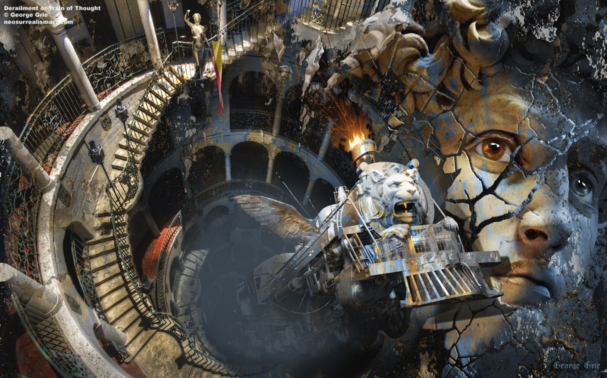

# Occupancy

Based on what was discussed previously, 99.99999% of world-lines are empty.

This means that most of the world lines that consciousness experiences are simply filled with other people, animals, and things that have no consciousness. These people and animals are called "shadows" or "shadow people" because while they appear to move and think, they have no consciousness. They are projections of consciousness, and their main consciousness is somewhere else. They are the "what ifs" of the action and the landscape that your consciousness interacts with.

To visualize: 

However, this is a simplification. In reality, all the “shadow people” possess a consciousness. This explains why the thoughts of those around you affect your MWI navigation.

There is some small percentage of a consciousness within every shadow entity. It’s just that the percentage is very tiny.

Each of the infinite lines of the world has consciousness running through it. Not just other people's, but yours as well. It's an almost insignificant amount. Your consciousness dominates all other consciousnesses in the world line.

# Some explanations

In quantum physics, when two quanta meet, they become entangled.

And in the realm outside of our reality; the one that contains all the near-infinite numbers of world-lines, there isn’t any time or space. It’s a region with no geometry. So everything can entangle in a quantum sense.

This means there is no world-lines are independent. They are all connected to each other.

What is actually happening is that clusters of world-lines entangle with other clusters of world-lines. They do this when ever a consciousness is injected into a world-line template.

And all of this entanglement puts a little infinitesimal part of you, and those around you near you in what ever world-line that your consciousness happens to occupy at that moment.

Of course, there are other factors at play. Injecting consciousness into a template does not mean that the entire infinite number of world lines are entangled. The effect will "fade out," or diminish as the variance increases.

It will resemble something like: 

The ability of a consciousness to entangle with “close proximity” world-lines happens automatically. However, the ability for the entangled world-lines to entangle with other world-lines drops off as the degree of variance increases.

Consider that this is happening for the billions upon billions of people that are entering and leaving our template surface. Each one is “making their marks”. All combine to provide some “foot print” of their present upon the template that you inhabit.

# Paradox

Assuming that everyone was 100% fully conscious in their bodies, and that the mind controlled our reality, our reality would probably become a very confusing, ever-changing mess of reality. Reality will also change as quickly and irrationally as dreams.

If a person's consciousness is the dominant consciousness in the world line he lives in, it means that his thoughts are also the dominant thoughts in the world line.

By controlling and directing thoughts, we can not only control our navigation, but our influence in the strong quantum entanglements of “near-by” (but untraveled) world-lines means that we have the potential to influence the trends and behaviors of the environment around us.

---