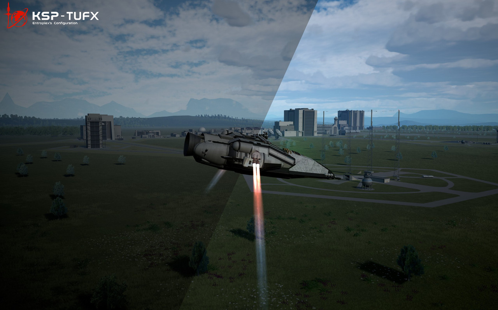
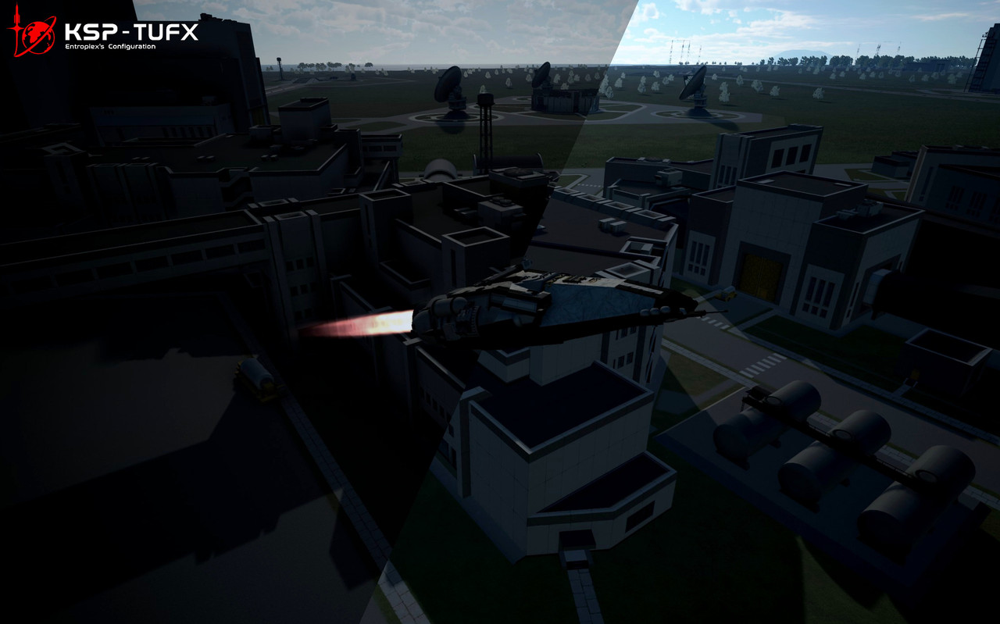
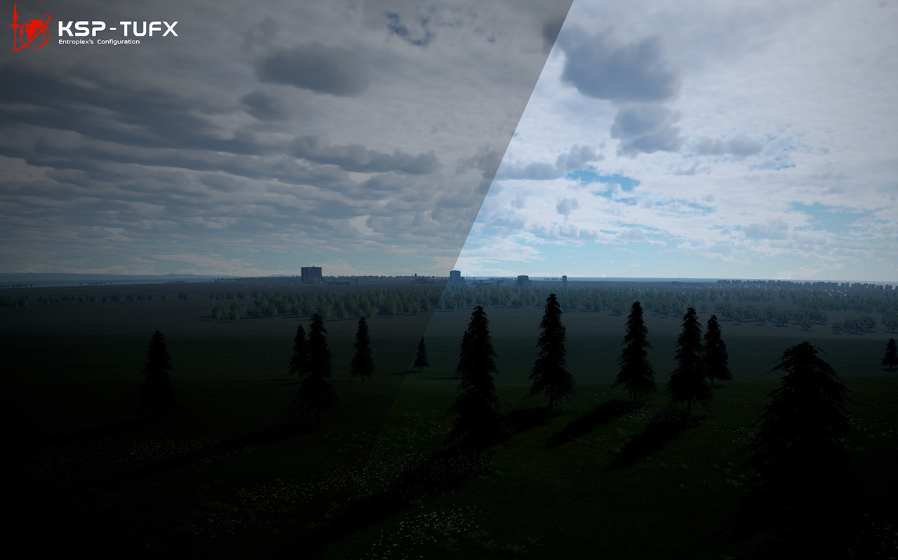

**This is a custom TUFX profile for Kerbal Space Program, inspired by the haunting atmosphere and cinematic visuals of Death Stranding.**

**v1 and v3 provide two different preferences. v1 tends to restore the dark atmosphere, and v3 is optimized for normal use.**

---
# v1 & v3

---
# Video

<iframe style="position:absolute;top:0;left:0;width:100%;height:100%" src="https://www.youtube.com/embed/d49b_XRJzfc?modestbranding=1"></iframe>

A short video here. Enjoy.

---
# Install

[Download: Enthalpiex/DeathStranding-TUFX-KSP](https://github.com/Enthalpiex/DeathStranding-TUFX-KSP)

- Download release file
    
- Unzip to Gamedata
