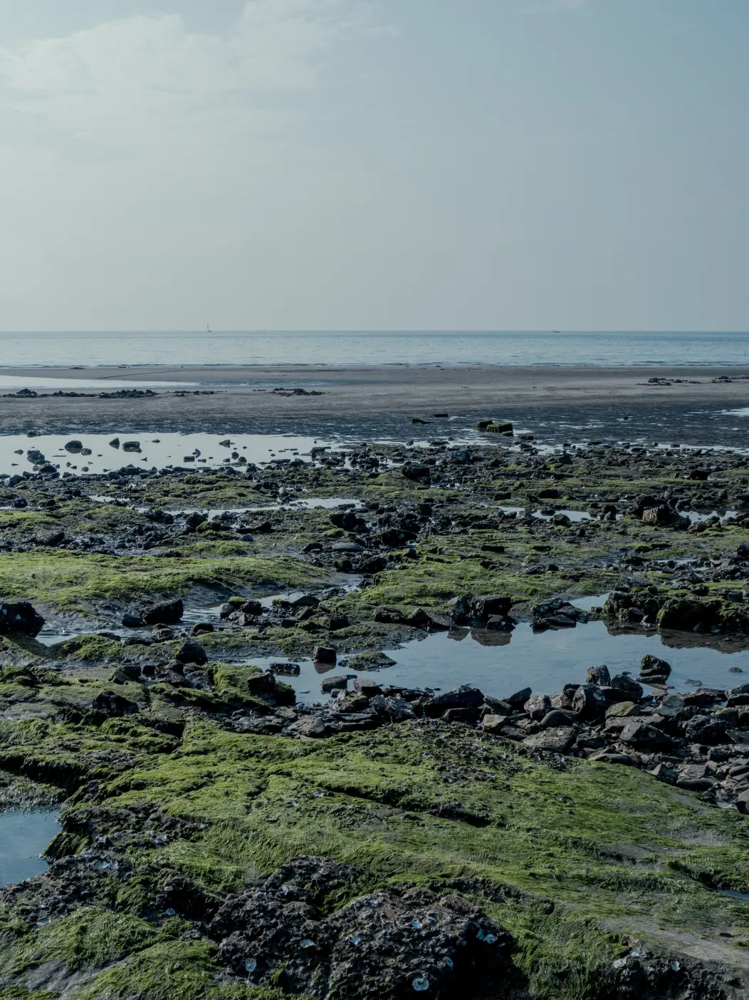
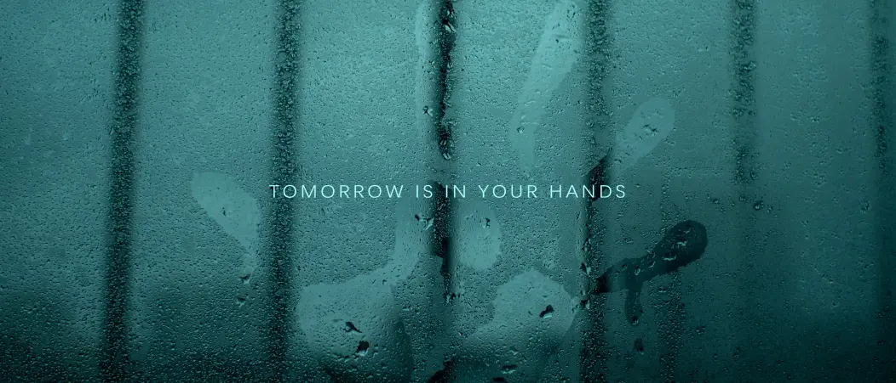
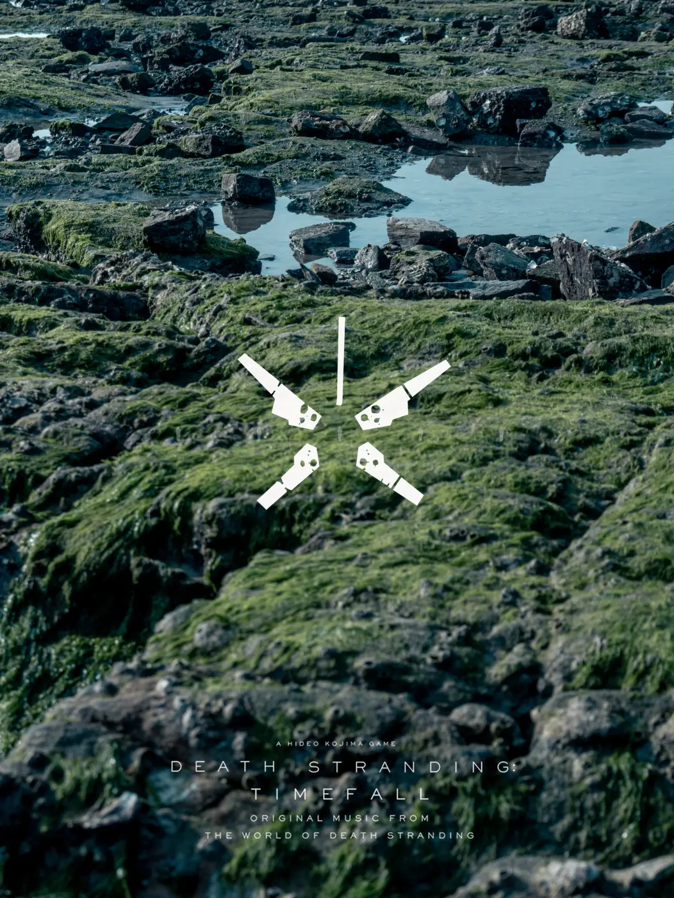
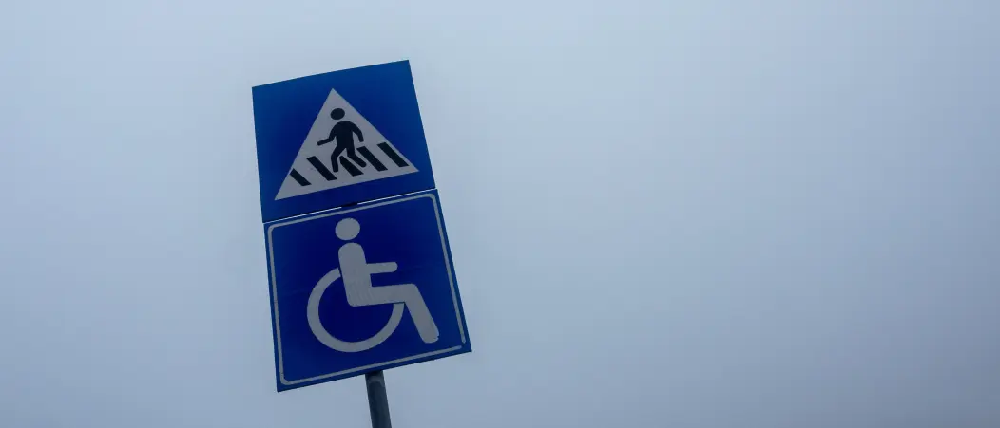
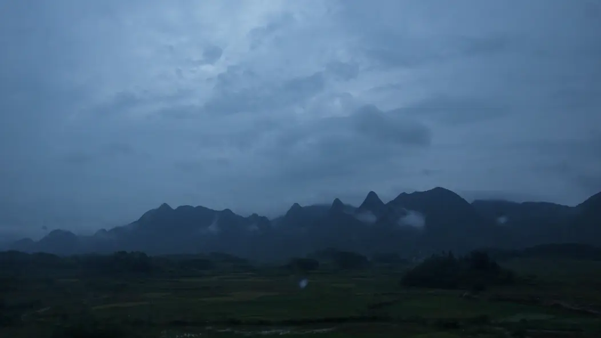

> **Once, there was an explosion.**  
> A bang which gave birth to time and space.  
> **Once, there was an explosion.**  
> A bang which set our world spinning.  
> **And then, came the next explosion.**  
> An explosion that will be our last.

> **Once, there was a silence.**  
> A rift where death bled into life.  
> **Once, there was a fall.**  
> Of cities, of bonds, of time untied.  
> **And then, came the walking man.**  
> With ghosts behind and hope ahead.

>**Once, there was a choice.**  
>To break, or bind, to flee, or find.  
>**Once, there was a bridge.**  
>Built not of stone, but heart and mind.  
>**And then, came the final thread.**  
>One soul, walking where angels dread.

> **Once, there was an explosion.**  
> Ever stranding. Ever becoming.  
> The rope is the hope.  
> And we are the bridge.  

