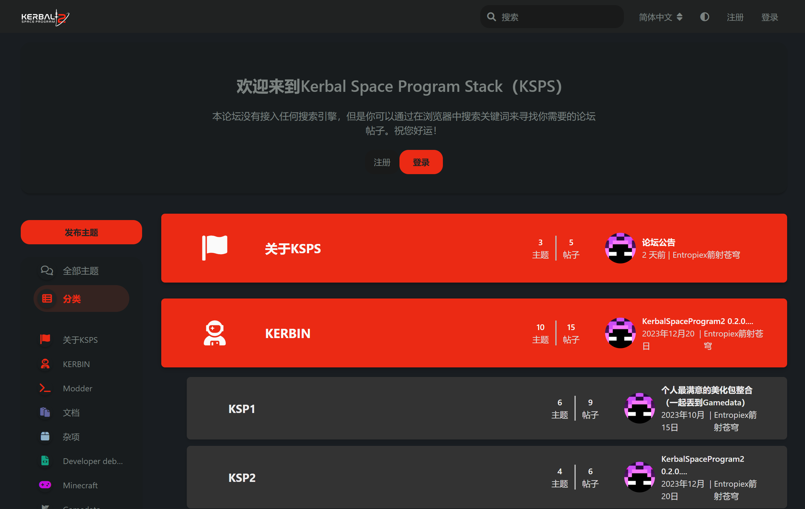

We can never know when an accident will happen.

Today I learned that the KSPS, which has been running for 3 years, was deleted not long ago and there is no backup.

# The KSPS

KSPS stands for `Kerbal Space Program Stack`. Its original purpose was to better communicate KSP-related content, including but not limited to works, modules, and some other ideas. Through the support of beautification components, KSPS later became a resource sharing platform based on KSP, with chat room functions.

Although KSPS is gone, BLOG will inherit everything from before, optimize, iterate and update continuously.