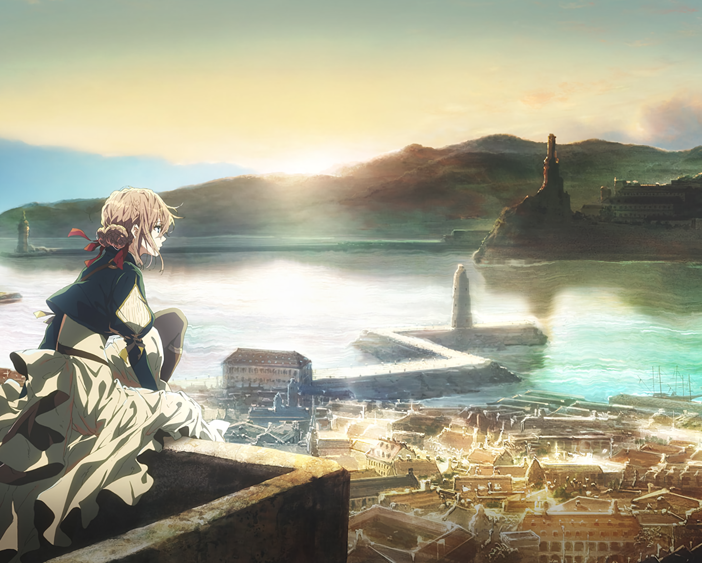

I sincerely thank the authors of Kyoto Animation and take this opportunity to remember the lives lost in the fire in 2019.

---

Seven years later, Violet has become a classic, and she is a well-deserved legend.

Violet is not a real person, but her existence is far more real than many real people. Every time I mention this name, I seem to be standing in front of the red-walled post office that is gradually covered by modern civilization, holding a yellowed letter in my hand, and looking up I can see the half-finished Eiffel Tower and the old times that are gradually fading away.

"May your heart be conveyed."

This is Violet's lifelong wish - she wants to be a person who can "transmit love." We find it difficult to accept her departure because she is as familiar as a family member, as close as a friend, and as warm as light. We believe that she is the legendary doll who once lived in this world, and appreciate her aristocratic behavior. We are happy that she can use a knife and fork skillfully, sad that she wants to strangle herself when she learns that the major is missing, amazed by her light footsteps on the lake, and moved by her saying without exception that "there is no letter that does not need to be delivered".

I rarely rate anime characters as "great", but Violet is a truly great character.

However, the character who was still accompanying us viewers not long ago, the gentle and powerful, powerful and sad person, is already a century of history. Her story is rarely known, and her figure is already the purple ink on a special stamp.

After her, there is no more Auto-Memory Doll.

It is a legend of the times.

We know this is a fictional story but are unwilling to admit it, we know this is a utopian obsession but are unwilling to give up, just like the line in Violet Evergarden: "You know it's not real? But you feel like you are there, sometimes happy, sometimes sad, why? Because you resonate with the protagonist in the story!"

The memory of civilization is essentially the urns of millions of Violet Evergarden, and we all live in the embers after she burned.

We saw Violet holding up an umbrella and becoming the girl stepping lightly on the lake, but we consciously ignored her gorgeous clothes that got soaked a few seconds later.

Violet is not a god, nor is she a tool, but a person as her name suggests. She turned the burning fire of karma into a mission to convey love.

We all know that she is fictional, but we all want to believe that she really existed. We all look forward to walking into that world one day, seeing the cottage by the sea, seeing scattered letters, hearing the sound of typewriters and metal prostheses, and perhaps we will gently say: "Thank you, Violet."

The reason why she is "great" is that she represents the ultimate purity of an emotion, a power that still lives towards the light in loss and pain.

People can come out of pain and become a more gentle existence; people can learn slowly through letters when they don't know what love is. 

Violet Evergarden, she is not immortal, she is just an ordinary girl who once survived the war, stained with blood but longing for love. But the places she walked, the letters she wrote, and the people she accompanied, are like the traces of stars falling in the night sky. Although short-lived, no one will forget that in that era when people could only communicate through letters, there was an 18-year-old girl who was fulfilling the mission of conveying love.

Her name is,

Violet Evergarden

