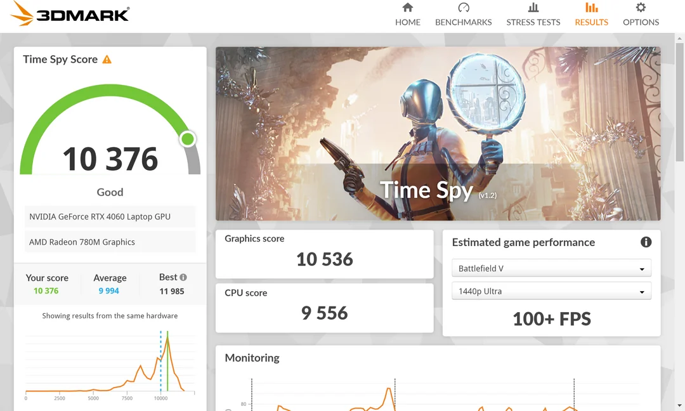
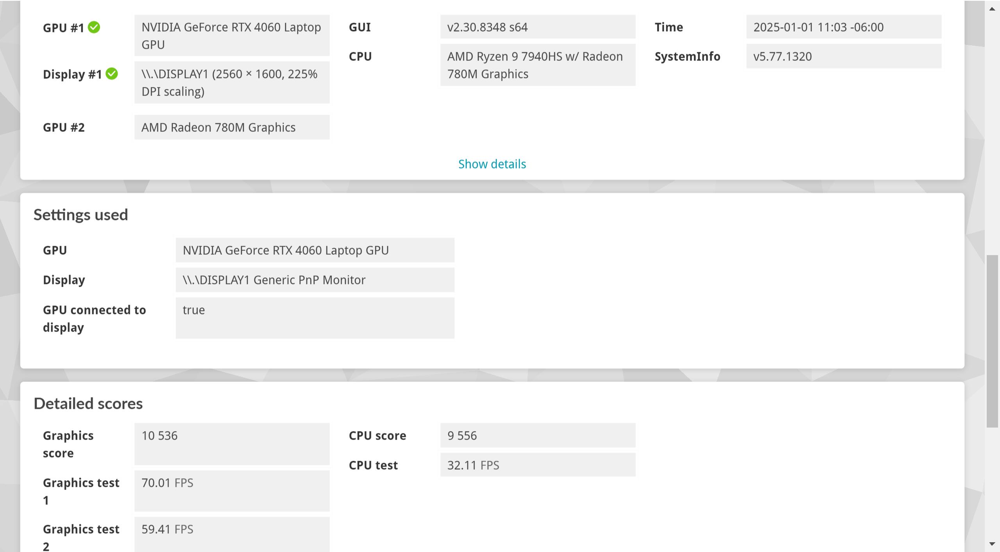
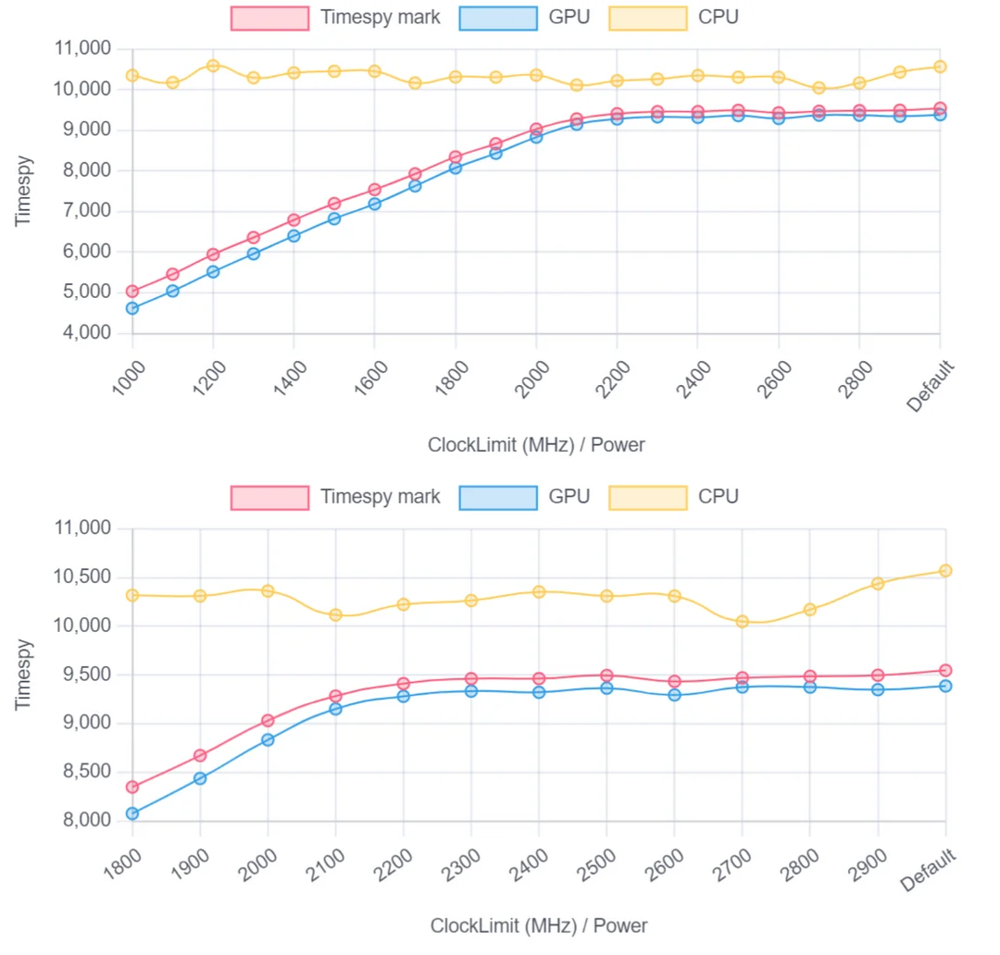
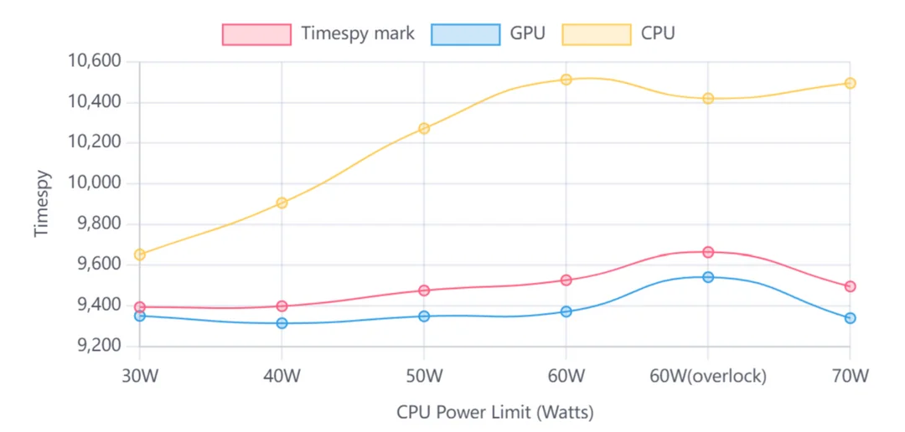
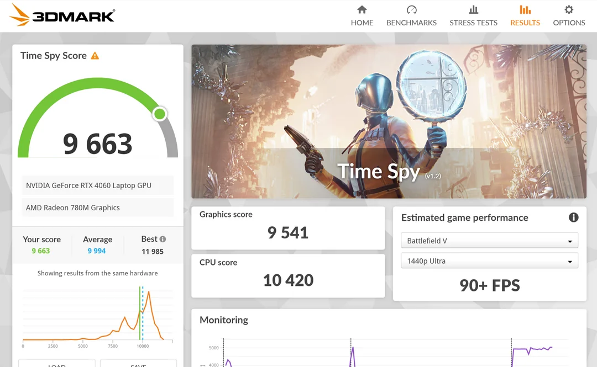
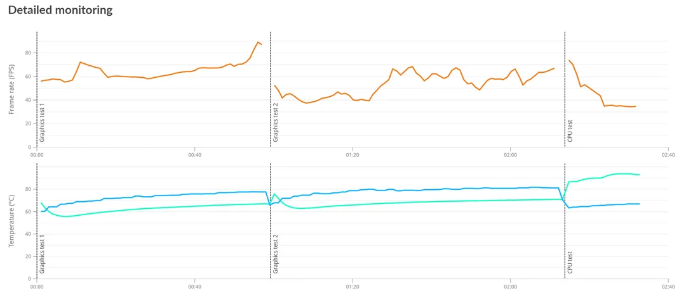
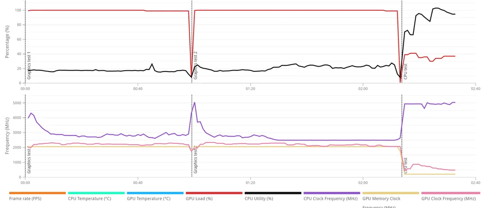

## Overview

**Original Post:**

[Flow X13 RTX4060 Timespy World Record (No Modification) : r/FlowX13](https://www.reddit.com/r/FlowX13/comments/1hret5p/flow_x13_rtx4060_timespy_world_record_no/)

[Revitalize Your Flow X13 in 2025: $0 Cost Performance Boost : r/FlowX13](https://www.reddit.com/r/FlowX13/comments/1hrdlmd/revitalize_your_flow_x13_in_2025_0_cost/)

|Device|ROG Flow X13 2023 RTX 4060|
|:-|:-|
|**RAM, vRAM**|**16G, 8G**|
|**Hardware Modification**|**No**|
|**Driver**|**555.97**|
|**Power**|**Original 130W**|
|**vBIOS**|**DELL RTX4060 Full Power 140W**|
|**Additional heat sink**|**NO**|
|**Ambient temperature**|**-12℃ / 10.4℉**|
|**Highest Timespy Score**|**10376**|
|**Highest Graphic Score**|**10536**|

## Result

## Summary

Since Timespy prefers GPU scores, limiting CPU power consumption and increasing GPU clock frequency as much as possible **successfully allows Flow X13 to compete head-on with gaming laptops that are twice as heavy as it.** **In comparison, the Timespy score of a 110W RTX4060 gaming laptop is 10500.**

Before the release of Flow X13, I wanted to achieve a Timespy score of more than 10000 at a weight of 1.3kg, and Flow X13 gave me this possibility.

The symbolism of this record is far greater than its practicality, because you obviously can't always use a laptop in the Arctic, and the CPU will compete with the GPU for power consumption. But I think this is the direction of future electronic products, extreme compactness and extreme performance.

But why is there no Flow disclosure in 2025? Is it going to be released in the middle of the year?

**I hope this experiment can help all Flow X13 users.**

**For the theoretical part, please see this post:** [Revitalize Your Flow X13 in 2025: $0 Cost Performance Boost : r/FlowX13](https://www.reddit.com/r/FlowX13/comments/1hrdlmd/revitalize_your_flow_x13_in_2025_0_cost/)

vBIOS: [VGA Bios Collection: Dell RTX 4060 Mobile 8 GB | TechPowerUp](https://www.techpowerup.com/vgabios/258363/258363)

# How To Improve Performance

>**WARNING: The tutorial has certain risks, please see the end of the article.**
## Overview

Today is the first day of 2025, I wish you all a happy new year.

Before CES 2025, I am sure that Flow X13 2023 will still be the only one of its size, because the 60Hz screen of PX13 is really not flattering.

Flow X13 balances everything: battery life, screen, CPU, graphics card, weight... Despite this, it is still difficult to compete with traditional gaming laptops due to its size.

However, with the release of many laptops in 2023 and 2024, it has become a reality for Flow X13 to achieve the default performance of gaming laptops. Today, the performance of the RTX4060 version will be very close to the level of access to **XG Mobile RTX3070  (or even XG Mobile RTX3080)**.

## How

The following examples are all based on the RTX4060 version.

Through testing, we can know that the power consumption allocation of Flow X13 is **20wCPU+50wGPU**. At this time, the core temperature is kept about **80℃,** which means that the scheduling is very conservative, so the primary goal is to use up all cooling redundancy. At this time, the maximum GPU frequency is only 1800MHz.

By flashing vBIOS, you can change the graphics card power consumption and scheduling strategy. Please Google how to flash vBIOS, I will not repeat it here. If you encounter green screen or blue screen problems, please try to change the nvflash version and avoid using GPU-Z to back up your vBIOS.

**Flashing vBIOS is risky, please make sure:**

**1. Back up the original vBIOS file**

**2. The GPU mode is Hybrid Output Mode (cGPU+dGPU) when flashing**

**3. The flashed vBIOS is safe and supports Dedicated GPU Direct Output Mode and Hybrid Output Mode, otherwise your computer might become a paperweight**

**4. vBIOS Device ID is "10DE 28E0" (Check your original device ID and choose vBIOS with same ID)**

**5. Reinstall the correct driver**

## Where

**A few tested vBIOS to choose from:**

**Alienware RTX 4060 vBIOS (TGP 70\~75W)** [VGA Bios Collection: Alienware RTX 4060 Mobile 8 GB | TechPowerUp](https://www.techpowerup.com/vgabios/265890/265890)

**Lenovo RTX 4060 vBIOS (TGP 80\~85W)** [VGA Bios Collection: Lenovo RTX 4060 Mobile 8 GB | TechPowerUp](https://www.techpowerup.com/vgabios/260488/260488)

Not recommended but optional: (Exceeding thermal limits)

Lenovo RTX 4060 vBIOS (TGP 90\~100W) [VGA Bios Collection: Lenovo RTX 4060 Mobile 8 GB | TechPowerUp](https://www.techpowerup.com/vgabios/259213/259213)

# How to configure G-Helper

Firstly, I used the vBIOS of the 70W Alienware X14R2 ([VGA Bios Collection: Alienware RTX 4060 Mobile 8 GB | TechPowerUp](https://www.techpowerup.com/vgabios/265890/265890)) to adjust the GPU Clock Limit through G-helper and drew the energy efficiency curve of the Flow X13 4060M graphics card:

Also as we all know, the power consumption and frequency of RTX 4060 Mobile are closely related:

|RTX 4060 Mobile 80W|1545-1890 MHz|
|:-|:-|
|**RTX 4060 Mobile 90W**|**1620-2010 MHz**|
|**RTX 4060 Mobile 105W**|**2115-2250 MHz**|
|**RTX 4060 Mobile 115W**|**2295-2370 MHz**|

From the figure, we can see that the CPU has the best performance when limited to 60 watts, and overclocking the graphics card will reduce some CPU performance. This is because the total power consumption is limited to \~125W.

In summary, you can save power by limiting the graphics card clock frequency and confirm its performance according to the table, while limiting the CPU to 60W can maximize utilization.

## Results

The computer has not undergone any hardware modification, the test date is January 1, 2025, 130W original power supply, and the driver version is 555.97. The test environment is room temperature 20\~25 ℃, and the computer is placed on a laptop stand to raise it.

## Summary

In comparison, the Flow X13 4070's Timespy score is up to 9440, with a CPU score of 10681 and a GPU score of 9251. The maximum speed of Flow X13 factory vBIOS is 8800, so you can get at least 10% performance improvement for free by using this method.

But is this really the limit?

## Warning

Ensure cooling redundancy!

Pushing a GPU beyond its design limits significantly stresses the VRM, particularly the high-side FETs, increasing the risk of failure. GPU core failures in laptops are rarely caused by core VRM issues. Instead, failures often stem from the vRAM VRM impacting the core or, more commonly, from CPU VRM failures.

**Even though this post is intended to improve performance without any modifications, to mitigate this situation, I strongly recommend upgrading to high-performance thermal putty, shim components, or improve thermal contact with the bottom panel.**

When improving the bottom panel contact make sure you use an additional heat sink to remove the heat from the baseplate. If you don't do this then this modification will have little effect other than making the baseplate hotter.

After testing, when the Timespy score of the unmodified Flow X13 was 10,000 points (±100), the stress test stability was only 90%.